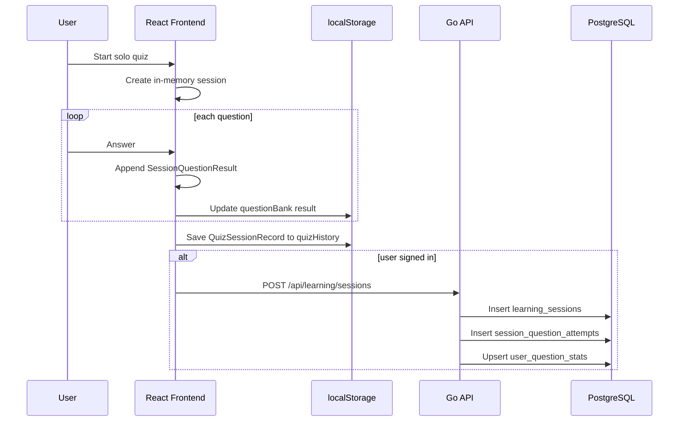
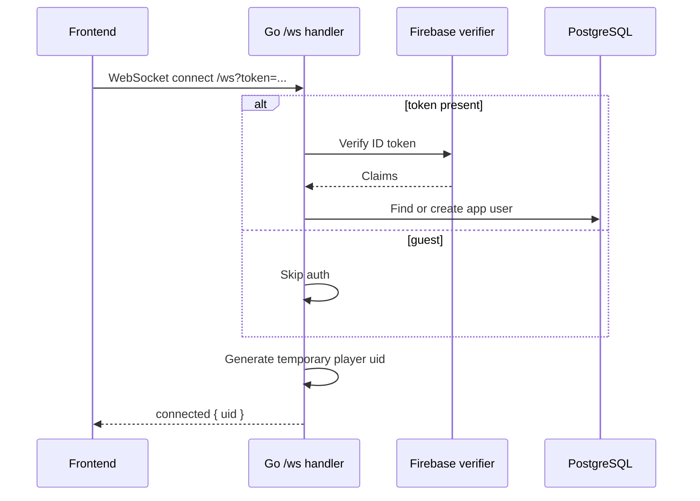
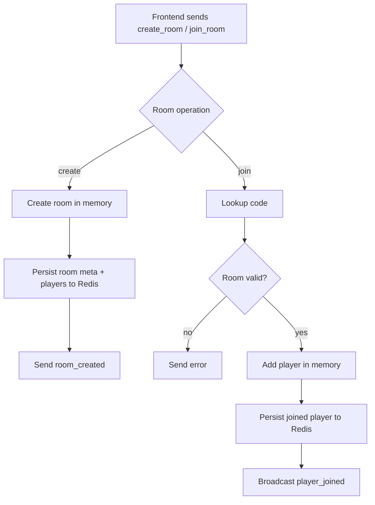
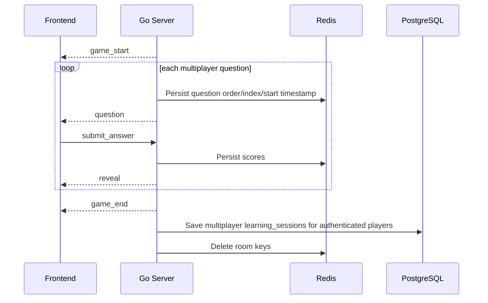
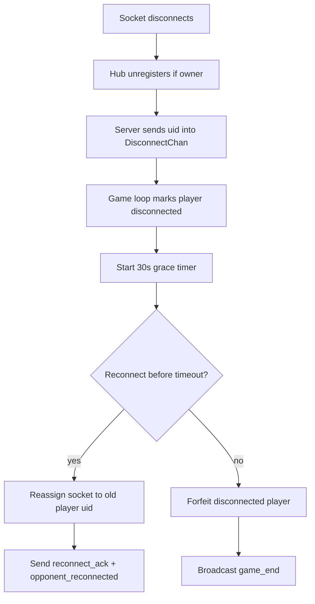
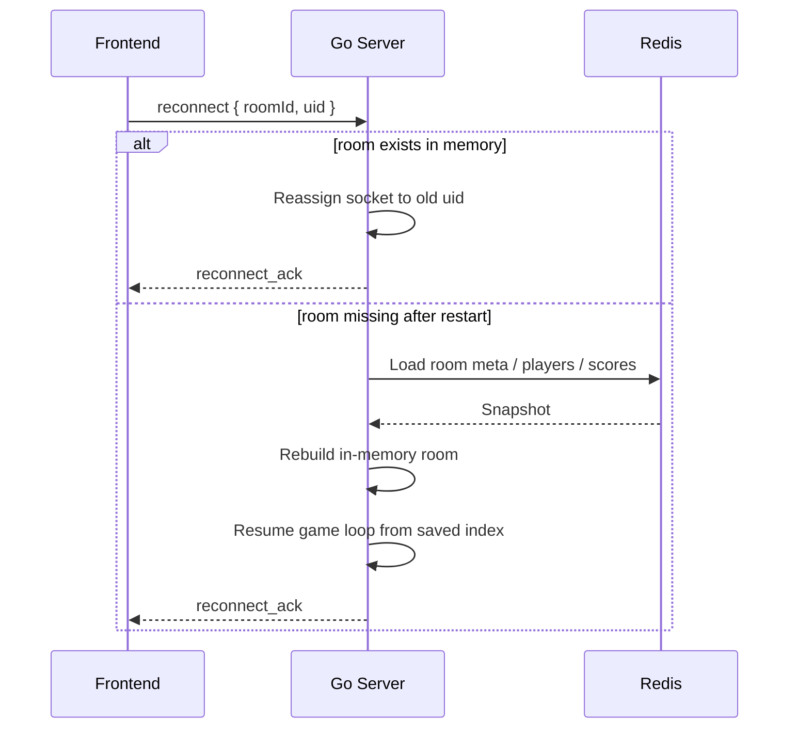

# App Interaction Flow

End-to-end documentation for how this app moves data across:
- React frontend
- Go backend
- PostgreSQL
- Redis
- browser local/session storage

This document focuses especially on:
- session flow
- WebSocket multiplayer flow
- disconnect handling
- reconnect handling
- server crash / restart recovery

It describes the current implementation, not the ideal future architecture.

## 1. System Map

### Main Runtime Pieces

- `Frontend (React + Vite)`
  - renders quiz UI
  - keeps transient UI state
  - stores solo history and question-bank state in browser storage
  - opens HTTP requests to `/api/*`
  - opens WebSocket connection to `/ws`

- `Backend (Go)`
  - verifies Firebase ID tokens
  - creates/loads app users
  - owns multiplayer room and game logic
  - persists learning sessions to PostgreSQL
  - persists live multiplayer room state to Redis

- `PostgreSQL`
  - durable app users
  - durable learning sessions
  - per-question attempts
  - question-level derived stats

- `Redis`
  - active room metadata
  - room membership snapshot
  - current question index and timing
  - live multiplayer scores
  - restart recovery source for in-progress matches

- `Browser localStorage`
  - solo history
  - question bank result state

- `Browser sessionStorage`
  - multiplayer reconnect identity
  - current multiplayer room id

## 2. Identity Model

The app uses different identities for different jobs.

- `firebase_uid`
  - external auth identity from Firebase
  - stable across browser sessions

- `users.id`
  - internal PostgreSQL user id
  - used for durable learning data

- `player uid`
  - temporary multiplayer socket identity
  - used for room membership and reconnect
  - intentionally separate from Firebase identity

Why this split matters:
- auth identity should stay stable
- room/socket identity should stay lightweight and replaceable
- reconnect should reclaim room identity without coupling gameplay state to Firebase UID

## 3. High-Level Data Boundaries

### Durable Data

Durable data goes to PostgreSQL:
- user rows
- learning sessions
- session question attempts
- user question stats

### Ephemeral Data

Ephemeral live multiplayer state goes to Redis:
- room code
- room player roster
- current question order
- current question index
- question start timestamp
- live scores

### Browser-Owned Data

The browser still owns some product state:
- solo history in localStorage
- question bank correctness history in localStorage
- multiplayer reconnect keys in sessionStorage

## 4. Solo Session Flow

### Frontend Path

When a user starts a normal solo quiz:

1. Frontend selects questions.
2. `QuizSessionContext` starts a session with:
   - `startTimeMs`
   - per-question timing state
   - empty result list
3. Each answer is appended to in-memory session state.
4. Each answer also updates the local question bank summary.
5. When the run finishes:
   - frontend builds a `QuizSessionRecord`
   - saves it into localStorage history
   - if user is signed in, POSTs a durable session to the backend

### Sequence Diagram

## 5. Authenticated HTTP Flow

Protected HTTP routes use Firebase ID tokens.

### Flow

1. Frontend signs in through Firebase SDK.
2. Frontend gets ID token from Firebase.
3. Frontend sends `Authorization: Bearer <token>` to `/api/*`.
4. Backend middleware:
   - parses token
   - verifies token with Firebase Admin
   - finds or creates `users` row
   - attaches auth context
5. Handler runs with `authCtx.User.ID`.

### Example Protected Routes

- `GET /api/me`
- `GET /api/me/history`
- `GET /api/me/weak-areas`
- `GET /api/me/category-accuracy`
- `POST /api/learning/sessions`

## 6. Multiplayer Connect Flow

Multiplayer supports both guest and authenticated players.

### At Connect Time

1. Frontend opens `/ws`.
2. If signed in, it appends `?token=<firebase_id_token>`.
3. If not signed in, it opens `/ws` without a token.
4. Backend:
   - optionally verifies token
   - optionally resolves app user
   - always creates a fresh temporary `player uid`
5. Backend sends `connected` with that temporary uid.

### Sequence Diagram

## 7. Multiplayer Room Flow

### Create Room

1. Frontend sends `create_room`.
2. Backend creates:
   - room id
   - room code
   - initial player entry
3. Backend stores room snapshot in:
   - memory
   - Redis
4. Backend replies with `room_created`.

### Join Room

1. Frontend sends `join_room`.
2. Backend looks up room by code.
3. Backend validates:
   - room exists
   - room is still in lobby
   - room is not full
4. Backend adds second player:
   - in memory
   - in Redis
5. Backend broadcasts `player_joined` to all players.

### Flowchart

## 8. Multiplayer Question Loop

Once both players are ready:

1. Backend broadcasts `game_start`.
2. Backend launches the room game loop.
3. Game loop shuffles multiplayer questions.
4. For each question:
   - set current question in room memory
   - persist question order/index/timestamp to Redis
   - broadcast `question`
   - collect answers until timeout or both answered
   - compute correctness and score
   - persist scores to Redis
   - broadcast `reveal`
5. After final question:
   - broadcast `game_end`
   - persist authenticated players' sessions to PostgreSQL
   - delete Redis room keys

### Sequence Diagram

## 9. Browser Session Storage In Multiplayer

The frontend stores reconnect context in `sessionStorage`.

### Keys

- `typr_mp_uid`
  - the player's room identity

- `typr_mp_room`
  - the current room id

### Why `sessionStorage`

This data is:
- browser-tab scoped
- temporary
- only needed for reconnect attempts

It is not meant to be durable product data.

## 10. Disconnect Handling During A Live Match

Disconnect policy is handled centrally inside the game loop.

### When One Player Disconnects

1. WebSocket read loop exits.
2. Hub unregisters only if that socket still owns the uid.
3. Backend emits disconnect uid into `Room.DisconnectChan`.
4. Game loop:
   - marks player disconnected
   - starts 30-second grace timer
   - informs opponent with `opponent_disconnected`

### If Player Reconnects In Time

1. New socket connects and receives a fresh temp uid.
2. Frontend sends `reconnect { roomId, uid }`.
3. Backend verifies room and ownership.
4. Hub reassigns the fresh socket from temp uid back to the original room uid.
5. Backend pushes uid into `Room.ReconnectChan`.
6. Game loop:
   - cancels grace timer
   - marks player connected
   - sends `reconnect_ack` with current question and scores
   - informs opponent with `opponent_reconnected`

### If Grace Expires

1. Game loop treats disconnected player as forfeit.
2. Backend broadcasts `game_end`.
3. Match is cleaned up.

### Flowchart

## 11. Reconnect Flow Details

The reconnect path has two important invariants.

### Invariant 1: The Room UID Must Be Reclaimed

The reconnecting client cannot continue as the new temporary socket uid.
It must reclaim the old room/player uid, otherwise:
- score ownership breaks
- answer routing breaks
- opponent state becomes inconsistent

### Invariant 2: Stale Sockets Must Not Unregister The New Owner

The hub uses ownership-aware unregister logic:
- a socket can only unregister a uid if it still owns that slot
- this prevents a stale replaced socket from deleting the newly active client

This is one of the most important multiplayer safety rules in the system.

## 12. Server Crash / Restart Recovery

The app does not keep in-progress multiplayer state in PostgreSQL.
Instead, it uses Redis snapshots plus reconnect-triggered reconstruction.

### What Gets Persisted To Redis

- `room:<id>:meta`
  - code
  - status
  - question order
  - current question index
  - current question id
  - question start timestamp

- `room:<id>:players`
  - serialized player roster

- `room:<id>:scores`
  - current scores

- `code:<join_code>`
  - maps join code to room id

### Recovery Strategy

When a reconnect arrives:

1. Backend checks in-memory room map.
2. If room is missing:
   - load room snapshot from Redis
   - rebuild in-memory `Room`
   - mark players disconnected by default
3. Backend verifies the reconnecting uid belongs to that room.
4. Backend reassigns the live socket to the old uid.
5. If match status is `playing`:
   - server resumes game loop using saved question order, index, and scores
   - reconnect path sends current question state back to player

### Sequence Diagram

## 13. Multiplayer Session Persistence To PostgreSQL

At the end of a multiplayer match:

1. Backend inspects room players.
2. If a player has `UserID`, backend creates a `multiplayer` learning session for that user.
3. Backend writes:
   - one `learning_sessions` row per authenticated player
   - one `session_question_attempts` row per question in that session
   - `user_question_stats` updates
4. Guest players are skipped for durable persistence.

Important:
- Redis is not the source of durable learning truth.
- Redis only keeps the live state needed to finish or recover a match.

## 14. Review Mode Flow

Review mode is a frontend-driven targeted practice flow.

### How It Starts

1. History page computes weak or wrong questions.
2. Frontend navigates to `/quizz?review=q1,q2,q3`.
3. Session page parses `review` ids.
4. Instead of balanced question selection, the frontend loads those exact questions.

### Review Improvement Summary

At review session start:
- frontend snapshots the previous `lastCorrect` state for each reviewed question

At review session end:
- frontend compares the final result to the pre-session state
- result screen shows:
  - which previously weak items improved
  - which still need review

This is currently browser-side product logic, not server-generated recommendation logic.

## 15. Current Limitations And Important Notes

### Durable Learning Coverage

Currently durable analytics are strongest for:
- solo sessions
- authenticated multiplayer session outcomes

Not yet fully durable:
- concept-level mastery
- review recommendation generation
- guest-to-account migration

### Redis TTL

Redis room recovery only works while keys are still alive.
Current room TTL is `2 hours`.

### Browser-Owned Review State

Question-bank weakness history still lives in localStorage.
That means:
- it is device/browser scoped
- it is not yet a complete cross-device learner model

### Crash Recovery Scope

Server restart recovery is practical, but bounded:
- it restores room and question state from Redis
- it does not recreate every prior in-memory transient detail
- it depends on players reconnecting

## 16. Mental Model Summary

If you want one compact rule-set for the app:

- Use Firebase for authentication.
- Use PostgreSQL for durable learner history.
- Use Redis for live multiplayer state and restart recovery.
- Use browser localStorage for current solo/product-side history.
- Use browser sessionStorage for multiplayer reconnect identity.
- Use player uid for room/socket logic.
- Use app user id for durable learning persistence.

